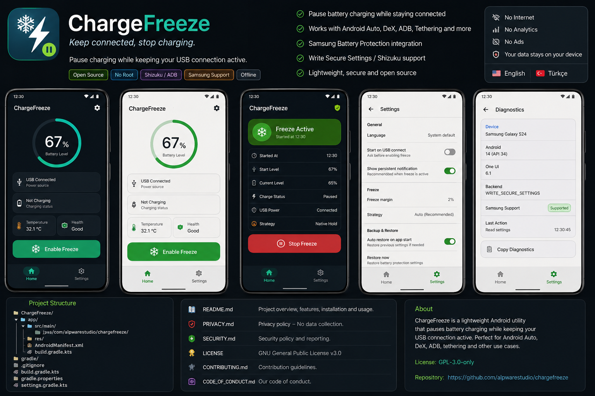

<p align="center">
  
</p>

<h1 align="center">ChargeFreeze</h1>

<p align="center">
  <strong>Keep connected, stop charging.</strong>
</p>

<p align="center">
  A lightweight, privacy-first and open-source Android utility for pausing battery charging while keeping your device connection active.
</p>

<p align="center">
  
  
  
  
</p>

---

ChargeFreeze uses supported manufacturer battery-protection controls to pause battery charging while keeping the device connection available.

It is designed for long-running wired scenarios such as **Android Auto, Samsung DeX, ADB, USB tethering, USB accessories, DACs and other persistent USB connections**.

> [!IMPORTANT]
> ChargeFreeze does **not** claim to electrically disconnect USB VBUS. On supported devices it controls the manufacturer's battery-protection mechanism. Hardware/firmware behavior varies, so support is capability-based and every write is verified.

## Preview

<p align="center">
  
</p>

<p align="center">
  <em>Keep connected, stop charging.</em>
</p>

The production UI follows the visual language shown above, with Home, Settings and
Diagnostics connected through the header and system back navigation. It intentionally
does not include a bottom navigation bar.

## Features

- Pause battery charging while keeping the device connection active
- Designed for Android Auto, DeX, ADB, tethering and USB accessories
- No root required
- Uses the manufacturer's existing battery-protection mechanism
- Automatically backs up the original battery-protection configuration
- Restores the original configuration when Charge Freeze is stopped
- Automatically restores the original configuration when USB power is disconnected
- Recovery support for interrupted Freeze sessions
- Detects firmware that continues charging and fails closed
- Lightweight foreground monitoring while Freeze is active
- Material 3 / Material You interface
- Dynamic color support
- English and Turkish localization
- No Internet permission
- No ads
- No analytics
- No telemetry
- Completely open source

## Principles

- No root
- No Internet permission
- No ads, analytics, accounts or telemetry
- Kotlin + Jetpack Compose + Material 3 / Material You
- English and Turkish
- Original battery-protection settings are backed up and restored
- Manufacturer backends are isolated so contributors can add devices without changing the core UI

## Current support

| Manufacturer | Status | Backend |
| --- | --- | --- |
| Samsung | Experimental | One UI Battery Protection (`Settings.Global`) |
| Google Pixel | Not implemented | Contributions welcome |
| Xiaomi/Redmi/POCO | Not implemented | Contributions welcome |
| OnePlus/Oppo | Not implemented | Contributions welcome |

The Samsung backend is based on settings observed on recent One UI firmware: `protect_battery`, `battery_protection_threshold`, and `battery_protection_recharge_level`. These are undocumented vendor implementation details and can change after firmware updates.

## Install

1. Build/install the APK or install it from GitHub Releases.
2. Enable Developer options and USB/Wireless debugging.
3. Grant the one-time privileged permission:

```bash
adb shell pm grant com.alpwarestudio.chargefreeze android.permission.WRITE_SECURE_SETTINGS
```

4. Open ChargeFreeze and verify that the device is reported as supported.
5. Connect the phone to the desired USB host and tap **Enable Freeze**.

To revoke the permission:

```bash
adb shell pm revoke com.alpwarestudio.chargefreeze android.permission.WRITE_SECURE_SETTINGS
```

## How it works

On supported Samsung firmware ChargeFreeze synchronously backs up the current Battery Protection mode and thresholds before making any change, enables the protection mode, and places the charging threshold just below the current battery level. A foreground session monitors USB power and the battery at a low frequency and moves the threshold down only when required. Stopping the session or disconnecting USB restores the original values.

This moving-threshold strategy is intentionally conservative. A future backend may use a native hold/recharge mechanism when it can be proven reliable on a firmware family.

## Safety and recovery

ChargeFreeze verifies every system-setting write and also checks whether Android continues to report active charging after the firmware has had time to apply the setting. The original values are committed to app-private storage before any modification. A persisted session is resumed after process recreation; incomplete preparation or restoration is recovered before another session can start. A failed restoration keeps the recovery record and exposes **Restore original settings** instead of discarding the backup.

The optional USB accessory prompt uses Android's public USB device/accessory attach events. Android does not expose a universal background attach event for every device-mode connection (for example every ADB cable connection), so manual activation remains the reliable path for those connections.

If anything looks wrong, open the app and use **Restore original settings**, or use Samsung Settings to reselect your preferred Battery Protection mode.

## Build

Requirements: Android Studio with JDK 17 and Android SDK 37.

```bash
./gradlew testDebugUnitTest lintDebug assembleDebug
```

The repository intentionally contains no signing keys, API keys, analytics SDKs or secrets.

## Project structure

```text
app/src/main/java/com/alpwarestudio/chargefreeze/
├── data/              # Battery monitoring and local recovery state
├── device/samsung/    # Samsung-specific implementation
├── domain/            # Controller contract and models
├── service/           # Active freeze session
├── ui/theme/          # Material 3 theme
├── MainActivity.kt
└── ui/screens/HomeViewModel.kt
```

## Contributing

See [CONTRIBUTING.md](CONTRIBUTING.md). Device support PRs should include the exact device, Android/firmware version, read/write behavior, restoration behavior and evidence that data connectivity remains usable.

## Privacy & security

See [PRIVACY.md](PRIVACY.md) and [SECURITY.md](SECURITY.md).

## License

GPL-3.0-only. See [LICENSE](LICENSE).
